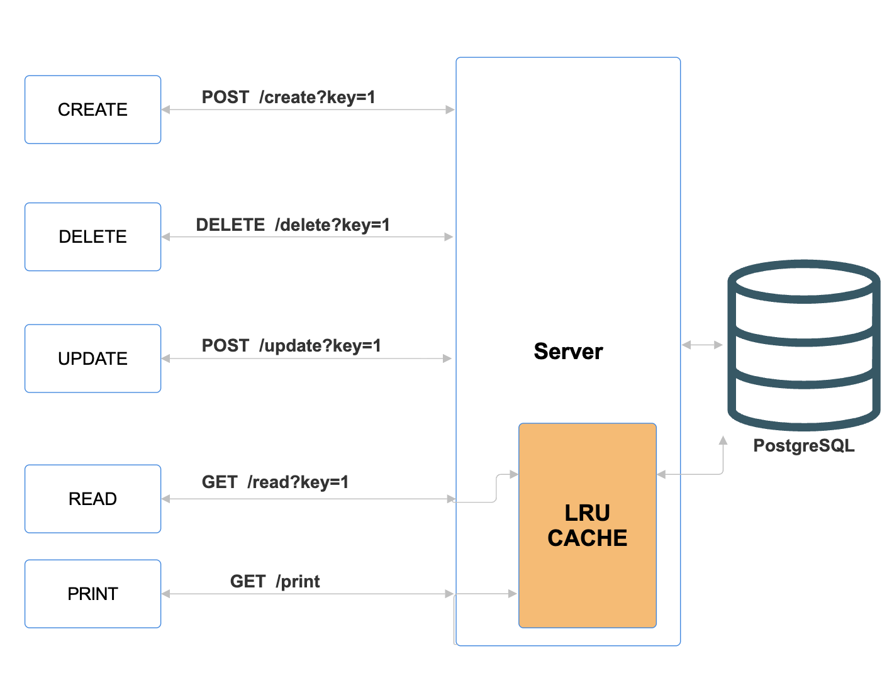

# C++ HTTP Key-Value Server with PostgreSQL & LRU Cache

This project is a C++-based HTTP server that implements a key-value (KV) store. It supports full CRUD (Create, Read, Update, Delete) operations and features an in-memory LRU cache to accelerate read requests.

The system is built in C++17 and follows a multi-tier architecture:

Backend: A C++-based HTTP server using httplib.h for handling all API requests.

Data Tier: A two-layer system composed of:

- An in-memory, LRU cache for fast, temporary storage.
- A permanent PostgreSQL database (libpqxx) as the persistent source of truth.

Architecture



Features

- Full CRUD: Provides create, read, update, and delete functionality.
- LRU Cache: Implements a "Cache-Aside" pattern. Read requests check the cache first, minimizing database load.
- Persistent Storage: Uses PostgreSQL to ensure data is saved permanently.
- Multi-threaded: Uses httplib.h, which handles each client request in a separate thread for concurrency.
- Utility Endpoint: Includes a `/print` route to inspect the current state of the cache.

Tech Stack

- C++ (C++17): Core language for the server, cache, & DB logic.
- PostgreSQL: The persistent relational database.
- libpqxx: The official C++ client library for PostgreSQL.
- httplib.h: A single-header C++ library for creating the HTTP/HTTPS server.
- json.hpp: A single-header JSON library for C++.

Setup and Usage

1. Prerequisites

Before you begin, ensure you have the following installed:

- A C++17 compiler (e.g., g++, clang++)
- PostgreSQL (version 15+ recommended)
- libpqxx and libpq (the C++ client and C library for Postgres)

On macOS with Homebrew, you can install the dependencies:

```bash
brew install postgresql@15
brew install libpqxx
```


2. Database Setup

The server is hardcoded to connect to the following database. Please make sure this database and user exist on your local machine.

- DB Name: unagarsahil
- User: postgres
- Password: Unagar@1248
- Host: localhost
- Port: 5432


3. Clone the Repository
```bash
git clone https://github.com/
<your-username>/<your-repo-name>.git
cd <your-repo-name>
```


4. Compile

This compile command assumes you are on macOS with Homebrew. You may need to adjust the paths (-I, -L) for your operating system.

```bash
g++ -I/opt/homebrew/include server.cpp -o server -std=c++17
-L/opt/homebrew/lib -L/opt/homebrew/opt/postgresql@15/lib
-lpqxx -lpq
```


5. Run the Server

The server will start on port 5078.
```bash
./server
```


You should see the output:

LRU Cache + PostgreSQL HTTP server running on port 5078
API Endpoints

The server exposes 5 routes for interacting with the key-value store.

| Route   | Method | Description                              |
|---------|--------|------------------------------------------|
| `/create` | POST   | Create a new key-value pair (hits cache & DB) |
| `/read`   | GET    | Read a value by key (checks cache, then DB)    |
| `/update` | POST   | Update an existing key’s value (hits cache & DB)|
| `/delete` | DELETE | Delete a key-value pair (hits cache & DB)       |
| `/print`  | GET    | Utility route to print the current LRU cache state|

cURL Examples

**Create**  
Adds a new key. The value is sent in the request body.  
```bash
curl -X POST "http://localhost:5078/create?key=111" -d "sahil"
```

**Read**  
Retrieves the value for a given key.  

```bash
curl -X GET "http://localhost:5078/read?key=111"
```


**Update**  
Updates the value for an existing key.  
```bash
curl -X POST "http://localhost:5078/update?key=111" -d "this is the new value"
```


**Delete**  
Removes a key and its value.  
```bash
curl -X DELETE "http://localhost:5078/delete?key=111
```


**Print Cache**  
Dumps the current state of the in-memory cache.  
```bash
curl -X GET "http://localhost:5078/print"
```

